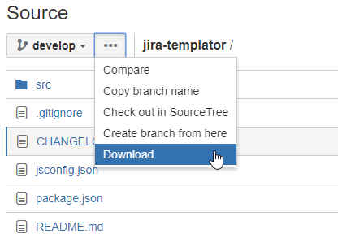
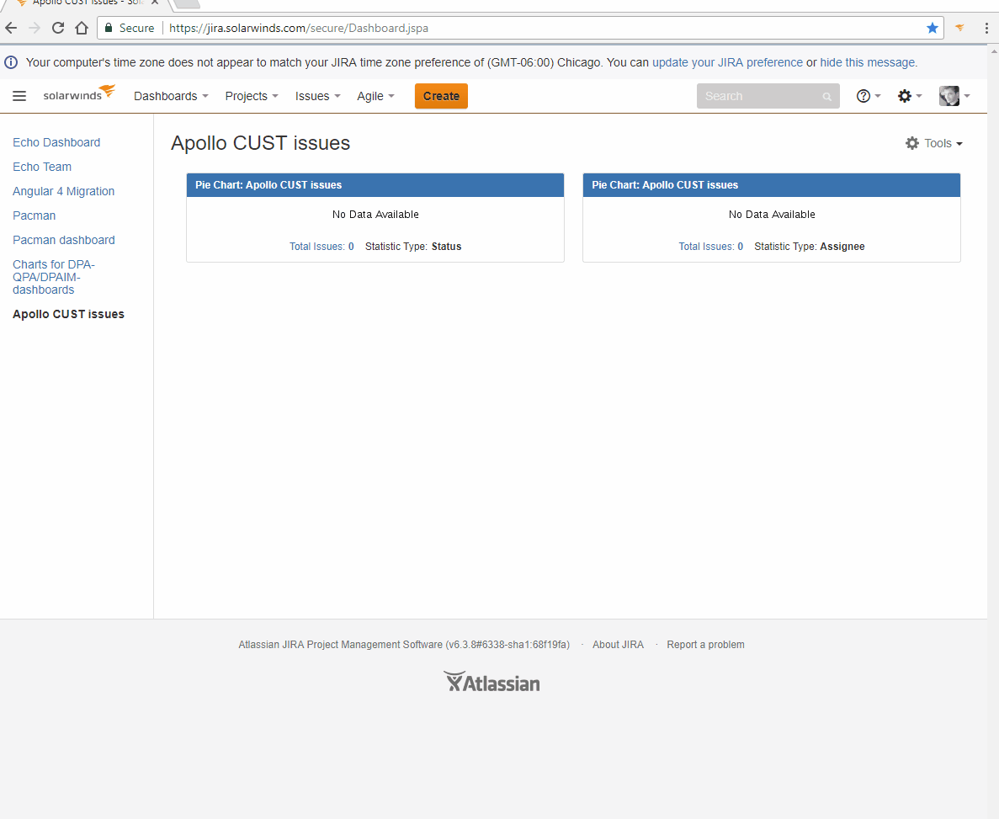

# Solarwinds Jira Templator

Solarwinds Jira Templator is a Chrome browser extension that helps JIRA users to create JIRA items and fill certain fieds with pre-defined templates and values.

[```HOW TO USE JIRA TEMPLATOR quick giude```](https://cp.solarwinds.com/display/NU/How+to+Use+Jira+Templator)

### What's new:
*   Added a possibility to set a custom template for every issue type
*   Visual design changes
*   Added quick access buttons to use the following options (mostly for debugging purposes):
    *   Pop into the browser console the local storage contents;
    *   Apply default per-defined templates for all issues
    *   Apply custom set templates for all issues
    *   Empty current templates
*   Information toast message on successful template save
*   Validation error messages:
    *   on loosing connection with content script
    *   on attempt to use new lines when setting up the custom templates.

### How to install:
1.  Clone this repo
2.  Open Chrome browser
3.  Proceed to: chrome://extensions/
4.  Enable the 'Developer mode' checkbox
5.  Click on 'Load unpacked extension...' button
6.  Choose the `src` directory which contains the `manifest.json` file
7.  DONE! :)

### How to update
1.  Using git
    *   In case you installed the extension via cloning the Bitbucket repository you can simply pull the latest changes from the develop branch.
2.  Downloading the latest package
    *   If you're not familiar with Git, you can simply download the latest build as an archive. Use DOWNLOAD option in Bitbucket repository
        
    
### Known Issues:
*   Sometimes when being on Jira page you get the "connection with receiving side lost" Error - that's ok, it 
basically means that the contentScript got cached. The information you attempted to save HAS BEEN SUCCESSFULLY SAVED 
and is already been stored in the storage. Simply refresh the page and you're good to go.
*   DOESN'T work with the `Visual` tab for description and Acceptance criteria fields.

### What it does:
1. Uses [approved templates](https://cp.solarwinds.com/pages/viewpage.action?spaceKey=UIFRD&title=Using+Jira+Templates) 
for specific JIRA items;
2. Fills in templates and desired values into:
    * Assignee
    * Summary
    * Description
    * Acceptance Criteria
    * Fixed Version
3. Automatically detects the chosen issue type and applies a corresponding template
4. Is able to insert the fixed comment to a comment section from extension's UI
5. Works with issues created in:
    * a separate tab
    * a modal dialog window
6. Users are able to set their own custom templates and store them (until the storage is cleared intentionally).
7. Users are able to pop up default templates, custom templates or empty templates in any time.
8. Users are given an ability to see the contents of the local storage and clear it if necessary (temporary)
9. Works on background ONLY on all Solarwinds JIRA pages (https://jira.solarwinds.com/)


