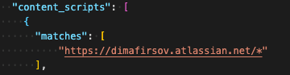
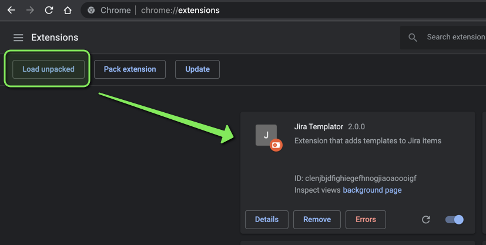
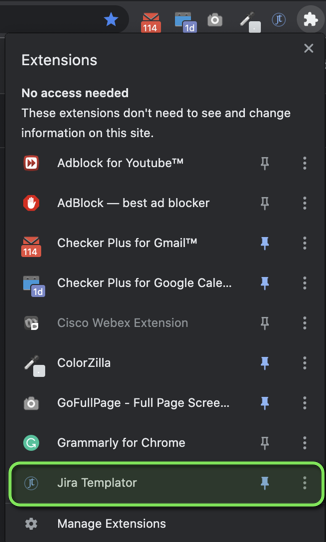

# Jira Templator

Jira Templator is a Chrome extension that allows you to use pre-defined templates for any jira items defined on your project. 
This can be a great improvement to the already established processes, as it helps to standardize the common format of the 
jira items. No more bug reports without expected and actual results, and stories with empty descriptions!

## Key features
* Allows to apply custom templates to selected web elements
* Allows to customize the selectors for the target elements
* Works automatically on the background, and requires from minimum to zero configuration
* Allows for quick access of some widely used features
* Offers customizations (see Configurable Settings below)
* FREE to use
## Configurable Settings
###  General Settings
* Allows to modify the `Global Trigger` selector (e.g. `Create` button, or some sort). It can vary depending on the Jira versions you have.
* Allows to tweak the `Load Timeout` - it is needed to delay the creation of all the necessary pollings and subscriptions until all the selectors
are eventually set in stone. This is a must have for the brand new Cloud Jira, which changes references to some critical elements on the page pretty often. 
On other versions of Jira, including the on-premise one, this timeout may be redundant, so the settings allow you to modify it however you want.
* Allows changing `Issue Type Selector` - the selector for the element which actually delivers the information about which jira item type is currently selected. 
This selector may also vary dramatically among the Jira versions, therefore it is customizable.

### Template Settings
* Allows enabling/disabling the templates configuration
* Allows to create new jira item types, rename, and remove existing ones
* Allows for multiple inputs cofigurations (e.g. you can apply different templates for `Description` and `Summary` inputs)

### Utils Settings
* Allows to clear the specific chrome local storage. This destructive option rolls back the application to defaults when re-launched.
* Allows to `Export` the current Jira Templator config to share it among the team
* Allows to `Import` the config and make everyone to be on the same page about the jira items templates.

### Main Page
* You're able to throw your favorite utils action to the main page to quickly access them

## How to install
1. Download the `jit-<version>.tgz` from the root of the default branch (`develop`) - it is the latest released version
    * Alternatively, if you're interested in other versions - visit the `release/<version>` branch, where you can find all released packages to time (check the `builds` folder)
2. Unpack the downloaded package
3. Open the `manifest.json` and adjust the `matches` setting to set the domains you want the plugin to work on (this is important as your jira will 99,9% be deployed somewhere else than mine). Also, you don't want the plugin to be active somewhere else apart from the jira-related pages.
    * 
4. Start the Chrome browser and navigate to the `Settings --> More Tools --> Extensions`
5. On the top-left side of the screen find the `Upload unpacked` button
    * 
6. Click the `Upload unpacked` button and choose the folder containing the `manifest.json` file (`<your_unpacked_directory>/jit`)
7. Find the extension under the `Extensions` quick access toggle on the bookmark panel. Pin it to quick access the extension.
    * 
8. Navigate to the Jira page (or refresh the existing one) and wait for the notification from the extension. It will appear on the top-right of the screen once the plugin is ready.
9. The plugin should already be working. Click the `Create` button and make sure summary and description fields get populated with the pre-defined templates.
10. If nothing is happening refer to the `Troubleshooting and FAQ` section.

## Troubleshooting and FAQ
1. I followed the installation guide, but the  plugin does not apply templates
    * Possible solutions can be
        * Try the `Create` button once again. The plugin does the polling to find the correct selectors on the page, so if you were too quick with the clicking and it didn't find the correct one at first (usually happens if clicked before the approving message appears on the screen) it will eventually find it in a second or two.
        * The `Create` button selector in your version of Jira is different than mine. You General settings to apply your selector as a global toggle for the plugin
        * The `Issue type` selector is different in your Jira version. See one point above - you can tweak it the same way in the settings
        * Try increasing the `loadTime` in General Settings
        * If none of the above fixed the behavior - file a ticket
2. I messed around with the storage and not it is corrupted now. How do I revert to the factory settings?
    * Go to Settings
    * Switch to `Utils` tab
    * Click the `Clear Storage` button
    * Re-launch the chrome extension UI

## DISCLAIMER
This is my first complete product, so, even though I tested it, I don't have an access to all the possible Jira modifications, versions and environments, so there may be bugs. 
Please check the `Troubleshooting and FAQ` section first before logging any new issues. If you still haven't found an answer to your problem, please log an issue using the provided template. 
I'll do my best to fix it.